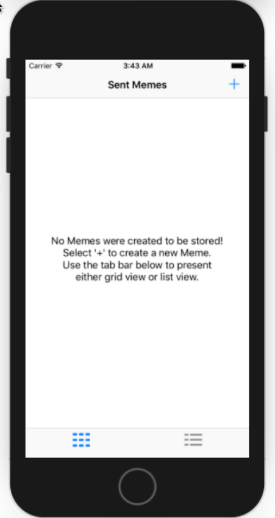
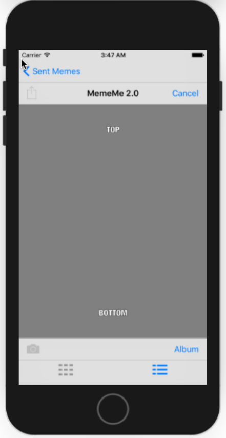
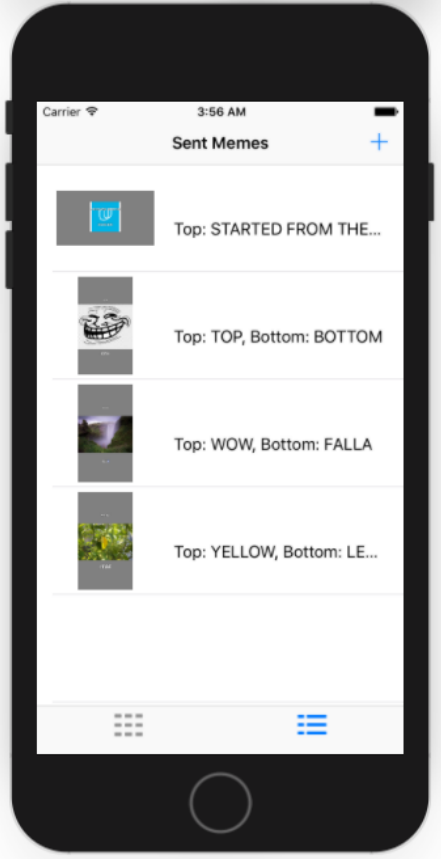
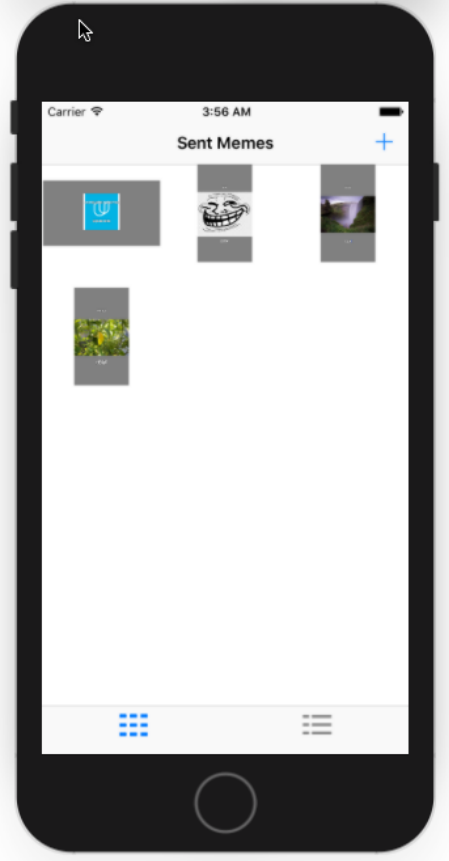
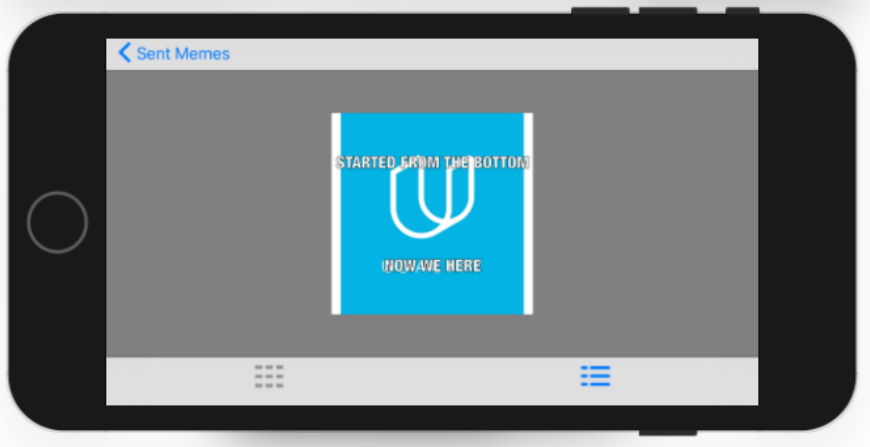

    
# MemeMe-2.0_Udacity
An app that enables a user to take a picture, and add text at the top and bottom to form a meme. The user will be able to share the photo on Facebook and Twitter and also by SMS or email. Memes will appear in a tab view with two tabs: a table view and a collection view. 
   
# MemeMe-2.0_Udacity Snapshots
    

